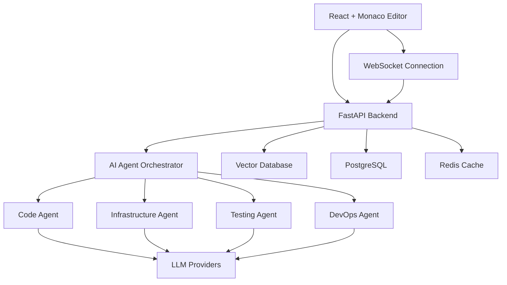

# AI Code Editor - Repository Structure Generator

This repository contains scripts to create a complete directory structure for an AI-powered code editor with multi-agent capabilities, similar to Windsurf but open-source.

## 🚀 Quick Start

### Option 1: Python Script (Recommended - Cross Platform)
```bash
# Download and run the Python script
python3 create_structure.py
cd ai-code-editor
```

### Option 2: Bash Script (Linux/Mac)
```bash
# Download and run the bash script
chmod +x create_structure.sh
./create_structure.sh
cd ai-code-editor
```

### Option 3: Windows Batch Script
```cmd
# Download and run the batch script
create_structure.bat
cd ai-code-editor
```

### Option 4: Using Make (All Platforms with Make installed)
```bash
# Create project structure
make scaffold

# Complete setup (structure + git + env files)
make quick-setup
```

## 📁 What Gets Created

The scripts create a complete project structure with **300+ files and directories** organized into:

### 🖥️ Frontend (`/frontend`)
- **React + TypeScript** application with Monaco Editor
- **Components**: Chat interface, code editor, action panels, diff viewer
- **Hooks**: Custom React hooks for editor, chat, WebSocket, and agent interactions
- **Services**: API clients, WebSocket handlers, storage utilities
- **State Management**: Redux/Zustand slices for editor, chat, and project state

### 🤖 Backend (`/backend`)
- **FastAPI** Python application with AI agent orchestration
- **Core Systems**: LLM gateway, memory management, intent classification
- **Specialized Agents**:
  - **Code Agent**: Generate, refactor, and validate code
  - **Infrastructure Agent**: Create Terraform, Docker, Kubernetes configs
  - **Testing Agent**: Generate unit, integration, and E2E tests
  - **DevOps Agent**: Create CI/CD pipelines and deployment configs
  - **Documentation Agent**: Generate docs, comments, README files
  - **Security Agent**: Scan for vulnerabilities and security issues

### 🏗️ Infrastructure (`/infrastructure`)
- **Docker**: Multi-container development and production setups
- **Kubernetes**: Complete K8s manifests and Helm charts
- **Terraform**: Infrastructure as code for cloud deployment
- **Scripts**: Setup, deployment, and monitoring automation

### 🔗 Shared (`/shared`)
- **TypeScript Types**: Shared interfaces between frontend and backend
- **Constants**: Common enums and configuration values
- **Utils**: Shared utility functions for validation and parsing

### 🛠️ Tools (`/tools`)
- **Scripts**: Development automation (setup, test, lint, build, deploy)
- **Generators**: Code generators for agents, components, and APIs
- **Monitoring**: Prometheus, Grafana, and alerting configurations

### 🧪 Tests (`/tests`)
- **Unit Tests**: Component and service level tests
- **Integration Tests**: API and WebSocket integration tests
- **E2E Tests**: Full workflow and user journey tests
- **Performance Tests**: Load testing and benchmarks

## 🎯 Project Vision

This AI code editor aims to provide:

1. **Natural Language Programming**: Write code through conversation
2. **Multi-Agent Architecture**: Specialized AI agents for different tasks
3. **Incremental Development**: Build systems step-by-step through chat
4. **Full DevOps Integration**: From code generation to deployment
5. **Collaborative Editing**: Real-time collaboration like Google Docs
6. **Infrastructure Automation**: Generate and deploy infrastructure as code

## 🧩 Key Features

### 💬 Chat-Driven Development
```
User: "Create a FastAPI app with JWT authentication and PostgreSQL"
AI: Creates models, routes, auth, database config, and tests
```

### 🔧 Infrastructure Generation
```
User: "Deploy this to AWS with auto-scaling"
AI: Generates Terraform, Dockerfile, K8s manifests, and CI/CD pipeline
```

### 🤖 Multi-Agent Coordination
- **Code Agent**: Handles programming tasks
- **Infra Agent**: Manages infrastructure and deployment
- **Test Agent**: Creates comprehensive test suites
- **Security Agent**: Ensures code security and compliance

### 📱 Modern UI/UX
- **Monaco Editor**: VS Code-like editing experience
- **Action Panels**: Context-aware AI actions
- **Diff Viewer**: Review AI changes before applying
- **Live Preview**: See results in real-time

## 📋 Development Workflow

### 1. Initial Setup
```bash
# Create structure and initialize
make quick-setup
cd ai-code-editor

# Edit environment variables
cp .env.example .env
# Add your LLM API keys (OpenAI, Claude, DeepSeek)
```

### 2. Development
```bash
# Start all development services
make dev

# Or start individually
make dev-frontend  # React app on :3000
make dev-backend   # FastAPI on :8000
```

### 3. Testing
```bash
# Run all tests
make test

# Run specific test suites
make test-frontend
make test-backend
make test-e2e
```

### 4. Code Quality
```bash
# Check code quality
make lint

# Auto-fix issues
make lint-fix

# Format code
make format
```

### 5. Docker Development
```bash
# Build and start all services
make docker-up

# View logs
make docker-logs

# Stop services
make docker-down
```

## 🏛️ Architecture Overview



## 🔧 Technology Stack

| Layer | Technologies |
|-------|-------------|
| **Frontend** | React, TypeScript, Monaco Editor, Tailwind CSS, Vite |
| **Backend** | FastAPI, Python, LangGraph, LangChain, Pydantic |
| **AI/ML** | OpenAI GPT-4, Anthropic Claude, DeepSeek, LangChain |
| **Database** | PostgreSQL, Redis, Weaviate/Chroma (Vector DB) |
| **Infrastructure** | Docker, Kubernetes, Terraform, Helm |
| **Monitoring** | Prometheus, Grafana, OpenTelemetry |
| **CI/CD** | GitHub Actions, ArgoCD |

## 📖 Documentation Structure

After running the scripts, you'll find comprehensive documentation in `/docs`:

- **Architecture**: System design and component interactions
- **API**: REST and WebSocket API documentation  
- **Deployment**: Local, Docker, and cloud deployment guides
- **Development**: Setup, contributing, and coding standards
- **User Guide**: How to use the AI code editor

## 🚦 Next Steps After Setup

1. **Configure Environment**:
   - Set up LLM API keys in `.env` files
   - Configure database connections
   - Set up authentication secrets

2. **Start Development**:
   ```bash
   make dev
   ```

3. **Create Your First Agent**:
   ```bash
   python tools/generators/agent-generator.py --name CustomAgent --type code
   ```

4. **Add Custom Components**:
   ```bash
   node tools/generators/component-generator.js --name CustomComponent --type react
   ```

5. **Deploy Locally**:
   ```bash
   make docker-up
   ```

## 🤝 Contributing

This structure supports a collaborative development environment:

- **Modular Architecture**: Easy to add new agents and components
- **Type Safety**: Shared TypeScript types ensure consistency
- **Testing**: Comprehensive test coverage for reliability
- **Documentation**: Living docs that evolve with the codebase
- **CI/CD**: Automated testing and deployment pipelines

## 📞 Support

- **Documentation**: Check `/docs` for detailed guides
- **Issues**: Use GitHub issues for bug reports and feature requests
- **Discussions**: Use GitHub discussions for questions and ideas
- **Contributing**: See `CONTRIBUTING.md` for contribution guidelines

## 🎉 Ready to Build?

This structure gives you everything needed to build a production-ready AI code editor. The modular design allows you to:

- Start with basic code generation and expand to full DevOps automation
- Add new AI agents for specialized tasks
- Integrate with any LLM provider
- Deploy anywhere from local development to cloud-scale production

**Happy coding! 🚀**