# AI-Powered Code Editor Architecture

## 🎯 Vision
Build a next-generation code editor that combines real-time collaborative editing with AI-powered development workflows, supporting everything from code generation to infrastructure deployment through natural language interactions.

## 🏗️ High-Level Architecture

```mermaid
flowchart TD
    subgraph Frontend["🖥️ Frontend Layer"]
        Editor[Monaco Editor + Extensions]
        Chat[LLM Chat Interface]
        Actions[Action Panel]
        Spec[Spec/Requirements Editor]
        Diff[Diff Viewer]
        Terminal[Integrated Terminal]
    end

    subgraph Orchestration["🤖 AI Orchestration Layer"]
        Intent[Intent Classifier]
        Planner[Multi-Agent Planner]
        Memory[Context & Memory Manager]
        Tools[Tool Registry]
    end

    subgraph Agents["🔧 Specialized Agents"]
        CodeAgent[Code Generation Agent]
        InfraAgent[Infrastructure Agent]
        TestAgent[Testing Agent]
        DevOpsAgent[CI/CD Agent]
        DocAgent[Documentation Agent]
        SecurityAgent[Security Scanning Agent]
    end

    subgraph Backend["⚙️ Backend Services"]
        FileSystem[File Management Service]
        GitOps[Git Operations Service]
        LLMGateway[LLM Gateway Service]
        VectorDB[Vector Database]
        ProjectDB[Project Database]
        ExecutionEngine[Code Execution Engine]
    end

    subgraph External["🌐 External Integrations"]
        LLMProviders[OpenAI/Claude/DeepSeek]
        GitProviders[GitHub/GitLab/Bitbucket]
        CloudProviders[AWS/GCP/Azure]
        CIPlatforms[GitHub Actions/CircleCI]
    end

    Frontend --> Orchestration
    Orchestration --> Agents
    Agents --> Backend
    Backend --> External
```



## 🧩 Component Architecture

### Frontend Layer (React + TypeScript)

#### 1. Monaco Editor Integration
```typescript
interface EditorManager {
  // Core editing capabilities
  openFile(path: string): Promise<void>
  saveFile(path: string, content: string): Promise<void>
  
  // AI-enhanced features
  showInlineSuggestions(suggestions: CodeSuggestion[]): void
  applyCodeAction(action: CodeAction): Promise<void>
  showDiff(original: string, modified: string): void
  
  // Collaborative features
  enableCollaboration(sessionId: string): void
  showCursors(users: CollaborativeUser[]): void
}
```

#### 2. Chat Interface
```typescript
interface ChatManager {
  sendMessage(message: string, context: EditorContext): Promise<void>
  receiveStreamedResponse(callback: (chunk: string) => void): void
  attachFile(file: File): void
  addCodeSelection(selection: CodeSelection): void
  executeAction(action: ChatAction): Promise<void>
}
```

#### 3. Action Panel
```typescript
interface ActionPanel {
  registerAction(action: EditorAction): void
  executeAction(actionId: string, params: any): Promise<void>
  
  // Built-in actions
  generateTests(): Promise<void>
  createDockerfile(): Promise<void>
  setupCI(): Promise<void>
  deployProject(): Promise<void>
  runSecurityScan(): Promise<void>
}
```

### AI Orchestration Layer

#### 1. Intent Classification System
```python
class IntentClassifier:
    def classify_intent(self, user_input: str, context: ProjectContext) -> Intent:
        """
        Classifies user intent into categories:
        - CODE_GENERATION
        - INFRASTRUCTURE
        - TESTING
        - DEPLOYMENT
        - DOCUMENTATION
        - DEBUGGING
        """
        pass

    def extract_entities(self, user_input: str) -> Dict[str, Any]:
        """Extract relevant entities like file names, tech stack, etc."""
        pass
```

#### 2. Multi-Agent Planner
```python
class MultiAgentPlanner:
    def create_execution_plan(self, intent: Intent, context: ProjectContext) -> ExecutionPlan:
        """
        Creates a plan involving multiple agents:
        1. Determine required agents
        2. Define execution order
        3. Set up inter-agent communication
        4. Plan rollback strategies
        """
        pass

    def execute_plan(self, plan: ExecutionPlan) -> ExecutionResult:
        """Execute the plan with monitoring and error handling"""
        pass
```

#### 3. Context & Memory Manager
```python
class ContextManager:
    def __init__(self):
        self.vector_db = VectorDatabase()
        self.project_memory = ProjectMemory()
        self.conversation_history = ConversationHistory()

    def get_relevant_context(self, query: str, max_tokens: int = 8000) -> str:
        """Retrieve relevant context using RAG"""
        pass

    def update_project_state(self, changes: List[FileChange]) -> None:
        """Update project understanding based on changes"""
        pass
```

### Specialized Agents

#### 1. Code Generation Agent
```python
class CodeAgent:
    def __init__(self, llm_client: LLMClient):
        self.llm_client = llm_client
        self.code_parser = CodeParser()
        self.validator = CodeValidator()

    async def generate_code(self, 
                           specification: str, 
                           language: str, 
                           context: ProjectContext) -> GeneratedCode:
        """Generate code based on natural language specification"""
        
        # Construct prompt with context
        prompt = self._build_prompt(specification, language, context)
        
        # Generate code
        response = await self.llm_client.generate(prompt)
        
        # Validate and parse
        parsed_code = self.code_parser.parse(response.content)
        validation_result = self.validator.validate(parsed_code)
        
        return GeneratedCode(
            content=parsed_code,
            validation=validation_result,
            metadata=response.metadata
        )

    async def refactor_code(self, code: str, refactor_instruction: str) -> RefactoredCode:
        """Refactor existing code based on instructions"""
        pass
```

#### 2. Infrastructure Agent
```python
class InfraAgent:
    def __init__(self, llm_client: LLMClient):
        self.llm_client = llm_client
        self.terraform_generator = TerraformGenerator()
        self.docker_generator = DockerGenerator()
        self.k8s_generator = KubernetesGenerator()

    async def generate_infrastructure(self, 
                                    requirements: InfraRequirements) -> InfrastructureCode:
        """Generate infrastructure as code"""
        
        if requirements.platform == "terraform":
            return await self.terraform_generator.generate(requirements)
        elif requirements.platform == "docker":
            return await self.docker_generator.generate(requirements)
        elif requirements.platform == "kubernetes":
            return await self.k8s_generator.generate(requirements)
        
    async def validate_infrastructure(self, code: str, platform: str) -> ValidationResult:
        """Validate infrastructure code"""
        pass
```

#### 3. Testing Agent
```python
class TestAgent:
    def __init__(self, llm_client: LLMClient):
        self.llm_client = llm_client
        self.test_generators = {
            "unit": UnitTestGenerator(),
            "integration": IntegrationTestGenerator(),
            "e2e": E2ETestGenerator()
        }

    async def generate_tests(self, 
                           code: str, 
                           test_type: str, 
                           framework: str) -> GeneratedTests:
        """Generate tests for given code"""
        
        generator = self.test_generators[test_type]
        return await generator.generate(code, framework)

    async def analyze_coverage(self, project_path: str) -> CoverageReport:
        """Analyze test coverage and suggest improvements"""
        pass
```

### Backend Services

#### 1. File Management Service
```python
class FileManager:
    def __init__(self, workspace_path: str):
        self.workspace_path = workspace_path
        self.git_manager = GitManager(workspace_path)
        self.file_watcher = FileWatcher()

    async def read_file(self, file_path: str) -> FileContent:
        """Read file with metadata"""
        pass

    async def write_file(self, file_path: str, content: str) -> WriteResult:
        """Write file with versioning"""
        pass

    async def create_diff(self, file_path: str, new_content: str) -> FileDiff:
        """Create diff for preview"""
        pass

    async def apply_changes(self, changes: List[FileChange]) -> ApplyResult:
        """Apply multiple file changes atomically"""
        pass
```

#### 2. LLM Gateway Service
```python
class LLMGateway:
    def __init__(self):
        self.providers = {
            "openai": OpenAIProvider(),
            "claude": ClaudeProvider(),
            "deepseek": DeepSeekProvider()
        }
        self.rate_limiter = RateLimiter()
        self.cost_tracker = CostTracker()

    async def generate_completion(self, 
                                request: CompletionRequest) -> CompletionResponse:
        """Route request to appropriate provider"""
        
        provider = self.providers[request.provider]
        
        # Apply rate limiting
        await self.rate_limiter.wait_if_needed(request.provider)
        
        # Make request
        response = await provider.complete(request)
        
        # Track costs
        self.cost_tracker.record_usage(request, response)
        
        return response
```

## 🔄 Interaction Patterns

### 1. Conversational Code Development
```
User: "Create a FastAPI app with JWT authentication"
├── Intent: CODE_GENERATION + INFRASTRUCTURE
├── Plan: [CodeAgent] → [SecurityAgent] → [TestAgent] → [DocAgent]
├── Execute:
│   ├── Generate FastAPI boilerplate
│   ├── Add JWT authentication
│   ├── Create unit tests
│   └── Generate API documentation
└── Present: Show diff, allow review/modification
```

### 2. Infrastructure-as-Code Workflow
```
User: "Deploy this to AWS with auto-scaling"
├── Intent: INFRASTRUCTURE + DEPLOYMENT
├── Plan: [InfraAgent] → [DevOpsAgent] → [SecurityAgent]
├── Execute:
│   ├── Generate Terraform/CDK code
│   ├── Create CI/CD pipeline
│   ├── Add security scanning
│   └── Set up monitoring
└── Present: Show infrastructure diagram, deployment plan
```

### 3. Incremental Development
```
User: "Add a user management system"
├── Context: Analyze existing codebase
├── Plan: Identify integration points
├── Execute:
│   ├── Create user models
│   ├── Add CRUD operations
│   ├── Update API routes
│   ├── Generate tests
│   └── Update documentation
└── Present: Show all changes, maintain consistency
```

## 🛠️ Technology Stack

### Frontend
- **Editor**: Monaco Editor (VS Code engine)
- **UI Framework**: React + TypeScript
- **Styling**: Tailwind CSS
- **State Management**: Zustand or Redux Toolkit
- **Communication**: WebSockets + tRPC

### Backend
- **API Server**: FastAPI (Python) or Express.js (Node.js)
- **Agent Orchestration**: LangGraph + LangChain
- **Database**: PostgreSQL + Redis
- **Vector Database**: Weaviate or Chroma
- **Message Queue**: NATS or Redis Streams

### AI/ML
- **LLM Providers**: OpenAI GPT-4, Anthropic Claude, DeepSeek
- **Embedding Models**: OpenAI Ada-002 or Sentence Transformers
- **Agent Framework**: LangGraph for multi-agent workflows

### Infrastructure
- **Containerization**: Docker + Docker Compose
- **Orchestration**: Kubernetes
- **CI/CD**: GitHub Actions
- **Monitoring**: Prometheus + Grafana
- **Logging**: ELK Stack

## 🔧 Implementation Phases

### Phase 1: Core Editor (Weeks 1-4)
- [ ] Monaco Editor integration
- [ ] Basic file management
- [ ] Simple LLM chat interface
- [ ] Git integration

### Phase 2: AI Integration (Weeks 5-8)
- [ ] Intent classification
- [ ] Code generation agent
- [ ] Context management
- [ ] Inline AI suggestions

### Phase 3: Multi-Agent System (Weeks 9-12)
- [ ] Infrastructure agent
- [ ] Testing agent
- [ ] Agent orchestration
- [ ] Memory system

### Phase 4: Advanced Features (Weeks 13-16)
- [ ] Collaborative editing
- [ ] CI/CD integration
- [ ] Security scanning
- [ ] Performance optimization

### Phase 5: Production Ready (Weeks 17-20)
- [ ] Self-hosting capabilities
- [ ] Enterprise features
- [ ] Advanced security
- [ ] Monitoring & analytics

## 🚀 Getting Started

1. **Setup Development Environment**
   ```bash
   # Clone the repository
   git clone https://github.com/yourorg/ai-code-editor
   cd ai-code-editor

   # Install dependencies
   npm install
   pip install -r requirements.txt

   # Setup environment variables
   cp .env.example .env
   # Add your LLM API keys
   ```

2. **Run the Development Stack**
   ```bash
   # Start backend services
   docker-compose up -d postgres redis vector-db

   # Start the API server
   cd backend && python -m uvicorn main:app --reload

   # Start the frontend
   cd frontend && npm run dev
   ```

3. **Configure LLM Providers**
   - Add API keys for OpenAI, Claude, or DeepSeek
   - Configure rate limits and cost budgets
   - Set up vector database with initial embeddings

This architecture provides a solid foundation for building a Windsurf-like AI-powered code editor that can grow from a simple coding assistant to a full-featured development platform.